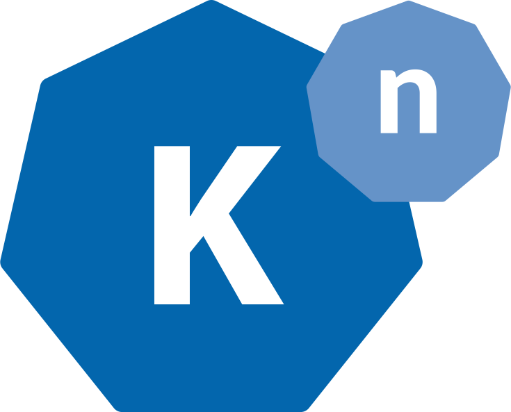

## Knative Brand Guidelines

The Knative trademark, 
logo ("Knative Trademarks") and knative.dev domain are trademarks of Google,
and are treated separately from the copyright or patent license grants
contained in the Apache-licensed Knative repositories on GitHub. Any use of
the Knative Trademarks other than those permitted in these guidelines must be
approved in advance. 

### 1. Purpose of the Brand Guidelines

These guidelines exist to ensure that the Knative project can share its
platform under open source licenses while making sure that the "Knative" brand
is protected as a meaningful source identifier in a way that's consistent with
trademark law. 

### 2. Acceptable Uses

Given the open nature of Knative, you may use the Knative trademark to refer
to the project without prior written permission in accordance with these
guidelines.

Examples of approved references include the following:

* To refer to the Knative project itself;
* To link to knative.dev;
* To refer to unmodified source code or other files shared by the Knative
  repositories on GitHub;
* In blog posts, news articles, or educational materials about Knative;
* To accurately identify that your design or implementation is based on or is
  for use with the Knative platform.
* Part of the name of a code repository as a means to indicate that the code
  being developed is related to Knative - as long as there is no indication
  that the Knative community endorses the repository.

Suggested templates: 

* "[Your Product] for Knative."
* "[XYZ] Conference for Knative Users."

### 3. Usage Guidelines

* The Knative name may not be used or registered in a manner that would cause
  confusion as to Google’s affiliation or endorsement (as the trademark owner).
* Don't use the Knative name as part of your company name, product name,
  domain name, or social media profile.
* Other than as permitted by these guidelines, the Knative name should not be
  combined with other trademarks, terms, or source identifiers.
* Don't remove, distort or alter any element of the Knative Trademarks without
  permission:
  * Do not shorten, abbreviate, or change the spelling of the Knative name,
    for example in mass communication, product names, social media profiles,
	domain names or event names).
  * Do not change the color or design elements of the Knative logo, or
    combine the logo with any other text.
* User groups, social media accounts, community websites, or other
  community-organized properties or organizations should follow the naming
  convention "[XYZ] for Knative Users" or "[XYZ] for Knative Contributors". 
* The name "Knative Working Group" can only be used by approved working groups
  maintaining code in the Knative GitHub organization under Knative Project
  governance.
* If you're organizing a conference or educational event, you can use the
  word Knative to refer to the technology that the event covers. However,
  Knative cannot be contained in the title name for your conference or
  educational event (such as KnativeConf or Knative Conference) without
  further explanation. An example of an appropriate usage could be "XYZ
  Conference for Knative Users" with XYZ being your own brand name. Any
  promotional materials should also prominently disclaim any official
  affiliation with or endorsement by Google and the Knative project.
* Don't use the Knative logo on product UI, or promotional materials without
  the Knative trademark owner’s  prior written permission. The Knative
  [Trademark Committee](https://github.com/knative/community/blob/main/TRADEMARK-COMMITTEE.md#getting-in-touch)
  will coordinate any communications with the trademark owner.
* You may use the Knative name or logo for non-commercial swag purposes.
* Don't use the Knative name or logo to indicate that your design or
  implementation is compatible with Knative without prior written permission. 

The Knative Trademark Committee understands the community desire for a
conformance standard, and we do plan to implement one at a future date. We
also recognize that conformance is a complicated issue with many variables,
and it is still early days for the Knative project. For comparison, the
Kubernetes project did not implement the [Certified Kubernetes Conformance
Program](https://github.com/cncf/k8s-conformance) until version 1.7. Our goal
is to have a Conformance Working Group created soon.

The Knative Trademark Owner and the Knative Trademark Committee reserve the
right to deny trademark permission for specific use cases if the use case
would not be in the best interest of the Knative Community.

### 3. Logo presentation

The Knative logo style uses specific fonts, colors, shapes (heptagon and nonagon) and size and placement relations. Use [this file](logo-guidelines.pdf) as a guide to the official logo fonts, colors and sizing.
